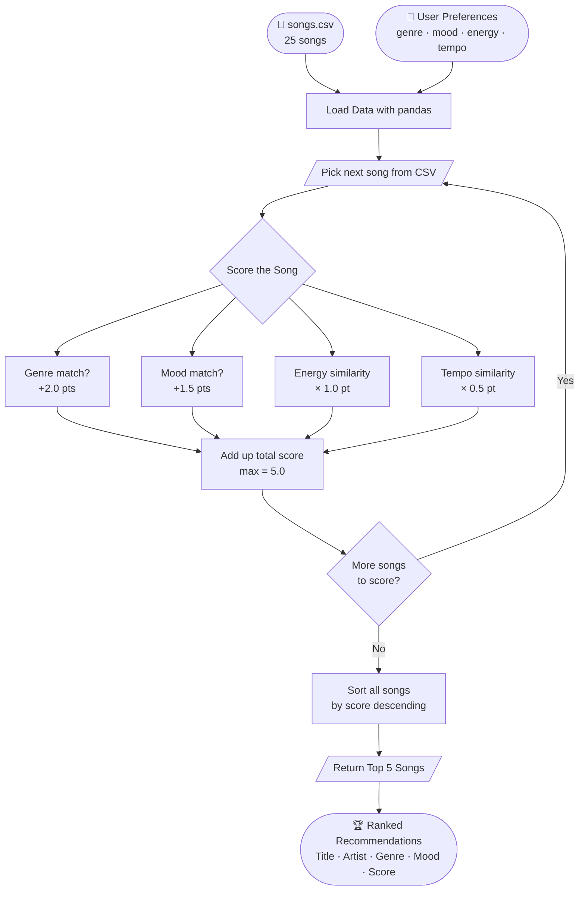

# AI110 Module 3 – Music Recommender Simulation

## Project Overview
A small content-based music recommender system built in Python. It scores and ranks songs against a user's preferences using weighted rules across genre, mood, energy, and tempo.

---

## How The System Works

Real-world recommendation systems like Spotify or YouTube analyze massive amounts of user behavior and song attributes to predict what a listener will enjoy next. They combine **collaborative filtering** (finding patterns across millions of users with similar taste) with **content-based filtering** (matching the audio features of songs a user already loves). At scale, these systems use deep learning models trained on billions of data points — including skips, replays, playlist adds, time of day, and even device type — to continuously refine their predictions.

My version prioritizes **content-based filtering**. It takes a user's stated preferences (genre, mood, energy level, and tempo) and scores every song in the dataset using a point-based formula. Each song is evaluated against the user profile, points are accumulated, and all songs are ranked from highest to lowest score. The top 5 results are returned as recommendations.

---

## Algorithm Recipe

Every song is scored out of a maximum of **5.0 points** using these rules:

| Rule | Points | Type |
|---|---|---|
| Genre matches user's favorite genre | +2.0 | Exact match |
| Mood matches user's favorite mood | +1.5 | Exact match |
| Energy close to user's target energy | up to +1.0 | Similarity score |
| Tempo close to user's target tempo | up to +0.5 | Similarity score |

**Similarity scoring formula:**
```
similarity = 1 - (|song_value - target_value|) / max_range
```
For energy (range 0.0–1.0): max_range = 1.0
For tempo (range 60–180 BPM): max_range = 120

**Ranking rule:** All 25 songs are scored, then sorted in descending order. The top 5 are returned as recommendations.

---

## Potential Biases & Limitations

- **Genre over-prioritization:** With +2.0 points for genre, a song that perfectly matches mood, energy, and tempo but is a different genre will always score lower than a genre-matched song with a poor mood fit. This could cause the system to miss great cross-genre recommendations.
- **Mood rigidity:** Mood matching is binary — either +1.5 or 0. A song labeled "Happy" gets zero mood points for a user who wants "Energetic," even though those vibes are closely related.
- **No user history:** This system only uses stated preferences, not actual listening behavior. Real systems improve over time by learning from skips, replays, and playlist adds.
- **Small dataset:** With only 25 songs, recommendations are limited. A real system would have millions of tracks to surface truly personalized results.
- **Missing valence feature:** There is no continuous happy/sad scale (valence), which is one of the most predictive features in real-world music recommenders like Spotify.

---

## System Flowchart



---

## Features Used

### 🎵 Song Object Attributes
| Feature | Type | Description |
|---|---|---|
| `song_id` | Integer | Unique identifier |
| `title` | String | Song name |
| `artist` | String | Artist name |
| `genre` | Categorical | Musical genre (Pop, Rock, Hip-Hop, etc.) |
| `mood` | Categorical | Emotional tone (Happy, Sad, Energetic, etc.) |
| `energy` | Float (0–1) | Intensity and activity level |
| `tempo_bpm` | Integer | Beats per minute |
| `danceability` | Float (0–1) | How suitable the track is for dancing |
| `acousticness` | Float (0–1) | Acoustic vs. electronic quality |
| `duration_sec` | Integer | Song length in seconds |

### 👤 UserProfile Object Attributes
| Feature | Type | Description |
|---|---|---|
| `favorite_genre` | Categorical | Preferred genre |
| `favorite_mood` | Categorical | Desired mood/vibe |
| `target_energy` | Float (0–1) | Preferred energy level |
| `target_tempo_bpm` | Integer | Preferred tempo |
| `target_danceability` | Float (0–1) | Preferred danceability |
| `target_acousticness` | Float (0–1) | Preferred acousticness |

---

## How To Run
```bash
python3 recommender.py
```

## Requirements
- Python 3.x
- pandas
- scikit-learn
